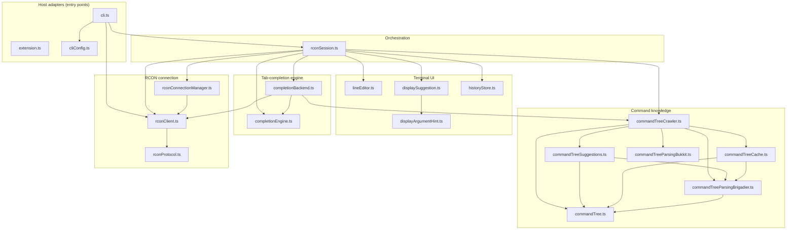

# Architecture Overview

This is a tour of `src/`: what each module is responsible for, and how they
fit together. Most files already carry a header comment that explains their
role and *why* they're shaped the way they are — this doc is the map that
ties those together.

The codebase is organized in layers, bottom-up:

1. **RCON connection** — raw protocol, socket lifecycle, reconnection.
2. **Command knowledge** — what commands/arguments exist on this server, and
   where that knowledge comes from (a server-side plugin or a `/help` crawl).
3. **Tab-completion engine** — a pure state machine that decides what to fetch
   and what to do with the result, independent of where the data comes from.
4. **Terminal UI** — the input line, the suggestion popup, history search —
   everything about rendering and editing, independent of RCON.
5. **Orchestration** — `RconSession`, the one class that wires all of the
   above together and is the single place that talks to the completion engine.
6. **Host adapters** — thin shims that make `RconSession` runnable as a VS
   Code `Pseudoterminal` or as a standalone CLI.

Two small **shared utilities** (`ansi.ts`, `logger.ts`) are used throughout
and are omitted from the diagram below for clarity — see their own section.
Logging itself goes directly through [consola](https://github.com/unjs/consola)'s
`ConsolaInstance` — there is no wrapper interface.

## Terminology

A few terms carry specific meaning throughout this codebase and its docs:

- **Plugin mode** — `RconSession.pluginMode` is `true` when the server
  answers the `tabcomplete`/`cmdusage` probe commands, i.e. a server-side
  **TabComplete** addon (see below) is installed. In this mode
  `RconCompletionBackend` asks the server directly for completions and
  argument usage on every keystroke; no command tree is built or cached.

- **Local mode** — the opposite of plugin mode: no TabComplete addon
  responded (vanilla servers, modded servers without the mod, or
  `--no-plugin`/`disablePlugin` below). `CommandTreeCrawler` crawls `/help`
  (and `minecraft:help`, where supported) once at startup to build a
  **command tree**, which `LocalCompletionBackend`/`commandTreeSuggestions.ts`
  query thereafter. This is the path exercised by the "no-plugin" help-crawl
  work — see `docs/technical/NO_PLUGIN_HELP_CRAWL.md`.

- **`--no-plugin` / `disablePlugin`** — a CLI flag / `RconSessionHost` option
  that forces local mode even when a compatible addon is present. Useful for
  developing/testing the help-crawl path against any server, but bugs found
  this way are real bugs for the (large) population of production servers
  that don't run the addon — not dev-only edge cases.

- **TabComplete** — the umbrella name for the server-side addons (the Paper
  TabComplete and Spigot TabComplete plugins under `paper-plugin/` and
  `spigot-plugin/`, and the Fabric TabComplete mod under `fabric-mod/`) that
  implement the `tabcomplete`/`cmdusage` RCON commands enabling plugin mode.

- **Command tree** / `CommandNode` — the data structure built by
  `commandTreeCrawler.ts` in local mode: every root command, its
  subcommands, and argument parameters, parsed from `/help` text by
  `commandTreeParsingBrigadier.ts`. Persisted on disk by `commandTreeCache.ts`.

- **`minecraft:` namespace prefix** — on Paper/Spigot, prefixing a command
  with `minecraft:` (e.g. `minecraft:help`) surfaces Brigadier's full
  `<arg>` syntax even for commands whose plain `/help` only shows a `Usage:`
  line; vanilla and Fabric reject this prefix entirely.
  `supportsMinecraftNamespace` detects which is true for the connected
  server, and `mergeHelpSources()` combines both responses when both are
  available. See `docs/technical/NO_PLUGIN_HELP_CRAWL.md`.

- **Fence packet** (a.k.a. double-packet technique) — the empty dummy RCON
  command sent partway through a response to detect where a fragmented
  response ends. See `docs/TECHNICAL.md` for the full writeup.

- **Built-in commands** — A set of always `/`-prefixed commands (`/help`, `/clear`,
  `/disconnect`, `/reconnect`, `/history`, ...) handled entirely by
  `RconSession.handleEnter` via a lookup table and never sent to the server
  as RCON commands. Anything typed *without* a leading `/` or not on the list of builtins 
  is sent to the server as-is (e.g. `tp Steve 0 64 0`).

- **`RconSessionHost`** — the narrow interface `RconSession` talks to instead
  of VS Code or stdio directly (`write`, `close`, `clipboard`, `cacheDir`,
  `dimensions`, plus optional `historySize`/`disablePlugin`). `cli.ts` is the
  sole implementation — see "Host adapters" below.

## Module dependency diagram

Note: `extension.ts` has no import-level dependency on `rconSession.ts` or
any module below it — at runtime it runs the bundled `dist/minercon.js`
(esbuild's bundle of `cli.ts` and its dependencies) as the terminal's
process, via `shellPath`/`shellArgs`. That process-spawn relationship isn't a
module dependency, so it isn't shown as an edge above.

## RCON connection

### `rconProtocol.ts`
The wire protocol. `RconProtocol` owns a `net.Socket`, encodes/decodes RCON
packets, and — the hard part — reassembles fragmented multi-packet responses
using the "double-packet" technique (see `docs/TECHNICAL.md` for the full
writeup). Knows nothing about Minecraft commands; just bytes in, strings out.

### `rconClient.ts`
`RconController` wraps `RconProtocol` with connect/auth/reconnect mechanics
and a **send queue** — every `send()` (completions, usage, executed commands)
is chained onto one promise so at most one RCON exchange is ever in flight on
the socket at a time. This is load-bearing: concurrent sends make some
servers close the connection.

### `rconConnectionManager.ts`
Owns the *lifecycle* on top of `RconController`: connection/reconnection
status and the exponential-backoff retry loop. Recreates the controller on
each reconnect attempt. `RconSession` reads connection status and reaches the
live controller through this class, and is notified via `onReconnected` so it
can reload the command tree after a drop.

## Command knowledge

This layer answers "what can the user type, and what does it mean" — built
once per server, either from a server-side plugin or by crawling `/help`.

### `commandTree.ts`
The command tree model: one recursive `Parameter` type (and the `CommandNode`
alias for its root-node use), shared by everything else in this layer.
`commandTreeParsingBrigadier.ts`/`commandTreeParsingBukkit.ts` construct `Parameter` trees,
`commandTreeSuggestions.ts`/`displayArgumentHint.ts` read them, and `commandTreeCrawler.ts`
ties construction and the cache together. This file is just the shape — no
parsing, no IO.

### `commandTreeParsingBrigadier.ts`
Pure parsing of Minecraft's Brigadier-shaped `/help` output (flat `/cmd
<args>` blobs, as returned by `minecraft:help` and vanilla's plain `help`)
into a `Parameter` tree (`commandTree.ts`), plus the root-listing parser (`parseHelpResponse`)
and the one-time namespace-support probe (`isUnsupportedNamespaceError`),
including the quirks documented in `docs/technical/` (concatenated help
lines, hyphenated literals, namespace differences between `/help` and
`minecraft:help`). Every export is a deterministic function — no IO.

### `commandTreeParsingBukkit.ts`
Pure parsing of Bukkit's hand-written `Description:`/`Usage:`/`Aliases:`
`/help <command>` pages — a different grammar from `commandTreeParsingBrigadier.ts`'s
flat Brigadier blobs, used only when `supportsMinecraftNamespace` (Paper/
Spigot). No shape-sniffing needed: which grammar applies follows directly
from `supportsMinecraftNamespace`, not from the response's content.

### `commandTreeCache.ts`
On-disk persistence for the command tree, server-scoped and versioned, aged
out after a week so a stale tree doesn't outlive a server's command set.
Mirrors the pattern later reused by `historyStore.ts`.

### `commandTreeCrawler.ts`
`CommandTreeCrawler` is the orchestrator for this layer: on `initialize()`
it either loads a cached tree (`commandTreeCache.ts`) or crawls `/help`
recursively (root commands, then subcommands/arguments), using
`commandTreeParsingBrigadier.ts` and `commandTreeParsingBukkit.ts` to interpret each response.
Produces the `CommandNode` tree that `commandTreeSuggestions.ts` queries.

### `commandTreeSuggestions.ts`
Pure suggestion generation: given the `CommandNode` tree and the user's
current input line, works out what to suggest next and what argument-help
text to show. No state, no IO — a deterministic function of the tree and the
input, which is what `LocalCompletionBackend` calls into.

## Tab-completion engine

### `completionEngine.ts`
The pure decision core for tab completion — a reducer:
`(Machine, Event) -> { machine, effects }`. Knows nothing about VS Code,
sockets, or wall-clock time. `RconSession` feeds it terminal events
(`tab`, `shiftTab`, `lineChanged`, `escape`, arrow keys, ...) and executes the
`Effect[]` it returns (RCON sends, ANSI writes, applying text to the line).
Every async race — a fetch resolving after the user has already typed more,
overlapping requests, etc. — is handled here as state transitions, so it's
testable with scripted event sequences rather than against a live server.

### `completionBackend.ts`
The seam between the engine and *where completions come from*. The engine
knows it needs completions/usage for a line; a `CompletionBackend` is asked
for them. `RconCompletionBackend` asks the server-side TabComplete
plugin over RCON (via `rconClient.ts`); `LocalCompletionBackend` asks the
locally-built tree (via `commandTreeCrawler.ts`/`commandTreeSuggestions.ts`).
Driving both modes through the same interface is what makes `RconSession`
mode-blind — "which backend" is decided once (`pluginMode`), not branched on
at every call site.

### `displayArgumentHint.ts`
Pure formatting for the argument-hint display: given a command's usage string
and the line typed so far, works out which argument position the user is at
and which usage token corresponds to it (for highlighting). Presentation
logic only — no fetching, timing, or staleness, which is why it lives apart
from `completionEngine.ts`.

## Terminal UI

### `lineEditor.ts`
Owns the input line: text, cursor, selection, and command history, plus every
operation that mutates them (insert/delete, cursor/selection movement,
kill/yank, history navigation) and redrawing the line to the terminal. Knows
nothing about RCON or completion — talks to its host via the small
`LineEditorHost` interface (`write`, `promptText`, `onLineChanged`, ...).
`maxHistorySize` (default 100) caps in-memory history.

### `displaySuggestion.ts`
Owns the suggestion-list / argument-hint popup rendered below the prompt: the
items, selected index, paging, and the ANSI rendering/clearing. Has no notion
of the completion engine — `RconSession` is the only place that dispatches to
it. Read-only `...Index()` queries return `number | null` ("nothing to do")
for paging decisions. Reused as-is for the Ctrl+R history-search popup.

### `historyStore.ts`
On-disk persistence for command history, server-scoped like
`commandTreeCache.ts` (a plain text file, one entry per line). Loaded once at
session start to seed `LineEditor`'s in-memory history, rewritten after each
command. `maxEntries` (default 100, configurable via
`RconSessionHost.historySize`) caps both load and save. Also holds the pure
state/matching for Ctrl+R reverse history search — filtering, deduplicating,
and cycling through in-memory history entries. Unlike `completionEngine.ts`,
there's no network round trip, so this is plain synchronous state transitions
with no reducer/effect machinery.

## Orchestration

### `rconSession.ts`
`RconSession` is the host-agnostic session orchestrator — all interactive
logic (key dispatch, command routing, reconnect handling, built-in `/`
commands) lives here, behind the narrow `RconSessionHost` interface (`write`,
`close`, `clipboard`, `cacheDir`, `dimensions`, plus optional
`historySize`/`disablePlugin`). It's the single place that constructs and
talks to the completion engine (`dispatchToEngine` → `step()` → execute
`Effect[]`), and wires together every module above: `RconConnectionManager` for
the live connection, `LineEditor`/`SuggestionDisplay` for rendering,
`CommandTreeCrawler`/backends for completions, `HistorySearchState`/
`HistoryStore` for Ctrl+R and persistence.

## Host adapters

### `extension.ts`
VS Code extension entry point (`activate`): registers commands and the
terminal profile provider, manages secrets (RCON password migration to
secure storage), and gathers connection details (saved settings/secrets or
prompts). Builds a `vscode.TerminalProfile` that runs the bundled
`dist/minercon.js` directly as the terminal's process — `shellPath:
process.execPath` (the Node runtime bundled with VS Code, run as plain node
via `ELECTRON_RUN_AS_NODE=1`) with `shellArgs: [minerconPath, host, port]`
and `env: { MCRCON_PASSWORD, MCRCON_HISTORY_SIZE }`. VS Code's own terminal
backend provides the pty; the extension has no pty code or `RconSession`
dependency of its own.

### `cli.ts`
Standalone CLI entry point. `tsc` compiles it to `out/cli.js`, packaged as
`out/minercon` for `npm`; esbuild (`esbuild.js`) separately bundles it, with
all dependencies (e.g. consola), to `dist/minercon.js` for the VS Code
extension's VSIX. Parses argv, resolves host/port/password/history-size (via
`cliConfig.ts`), establishes the `RconController` connection, builds a
`RconSessionHost` over `process.stdout`/raw-mode `stdin`, and wires up signal
handling for clean teardown. The sole `RconSessionHost` implementation — run
directly for the terminal CLI, or as the VS Code extension's
integrated-terminal process (`extension.ts`).

### `cliConfig.ts`
Pure helpers for the CLI's config resolution — the saved
`~/.config/minercon/config.json` (host/port/historySize), port/history-size
validation, and the precedence rules (CLI flag → env var/saved config →
prompt). Kept separate from `cli.ts` so this logic is unit-testable without
spawning a process or touching stdin/stdout.

## Shared utilities

### `ansi.ts`
Named ANSI SGR escape codes and `style`/color helpers, centralizing the raw
`\x1b[...m` literals previously scattered across the UI modules. Also home to
`formatMinecraftColors`/`stripColors`, which translate the server-controlled
Minecraft `§`-color-code alphabet to/from ANSI.

### `logger.ts`
Just `errorMessage(err: unknown): string`, for rendering a caught value as a
display string. Logging itself is consola's `ConsolaInstance`, passed
directly to every class that needs it (`import type { ConsolaInstance } from
'consola'`) — `cli.ts` and `extension.ts` each construct one with
`createConsola(...)`, and tests use the `silentLogger`/`recordingLogger`
helpers in `src/test/support/testLogger.ts`.

## Where to start reading

- **Tracing a keypress**: `rconSession.ts`'s `handleInput` → `keyHandlers` /
  `lineEditor.insertText` → (if it changes the line) `dispatchToEngine` →
  `completionEngine.ts`'s `step()`.
- **Tracing a connection drop**: `rconConnectionManager.ts`'s retry loop →
  `onReconnected` → `rconSession.ts`'s `initializeCommands()`.
- **Tracing "what does Tab do without a plugin"**: `completionEngine.ts`
  `step()` → `LocalCompletionBackend` (`completionBackend.ts`) →
  `commandTreeSuggestions.ts` → the `CommandNode` tree built by
  `commandTreeCrawler.ts` from `commandTreeParsingBrigadier.ts`.
- **Tracing Ctrl+R**: `rconSession.ts`'s `handleHistorySearchInput` →
  `historyStore.ts` (pure state) → re-render via `displaySuggestion.ts`.
