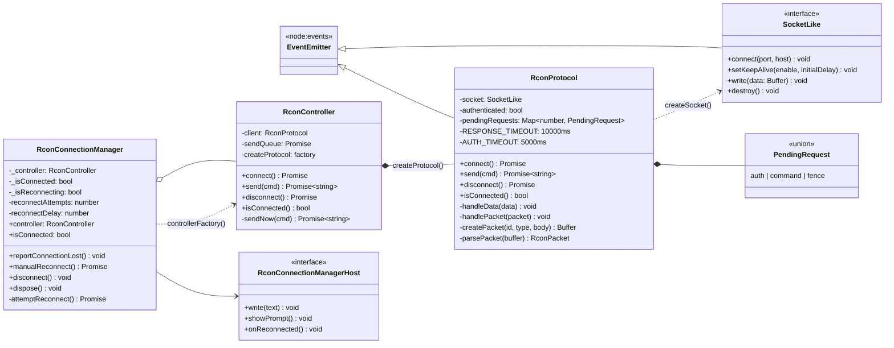
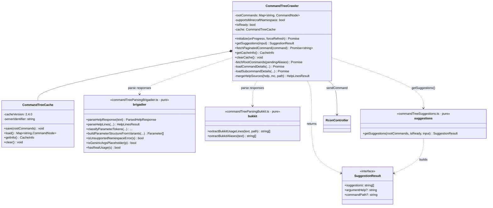
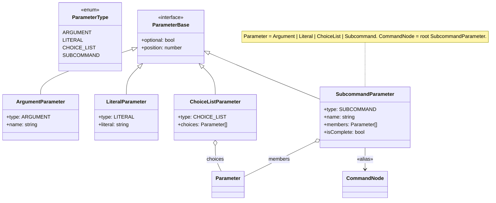
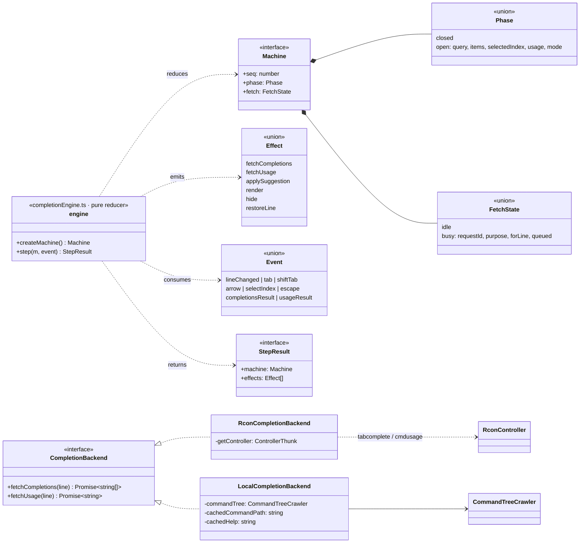
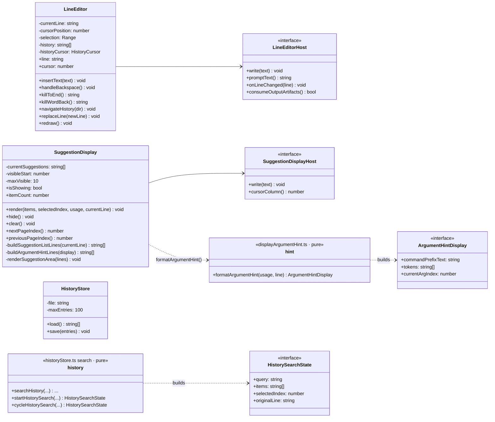
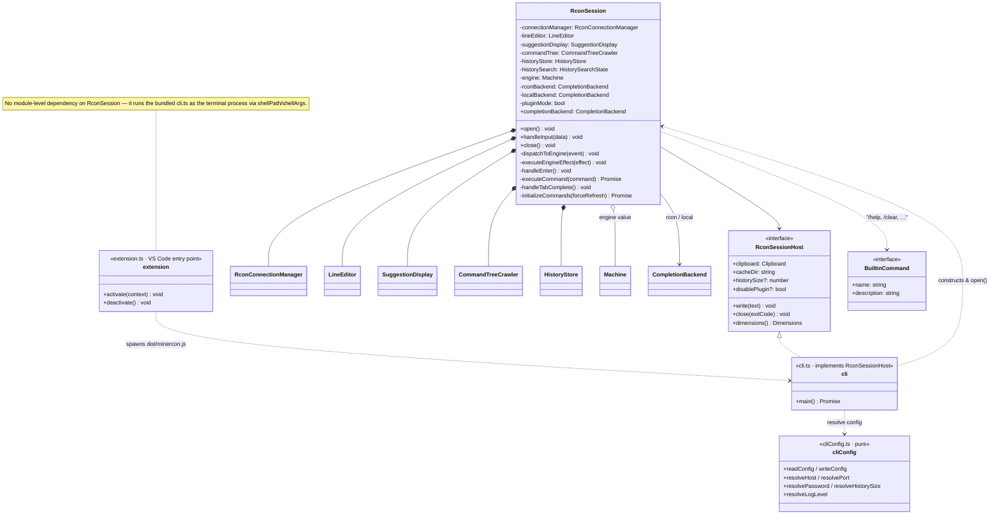
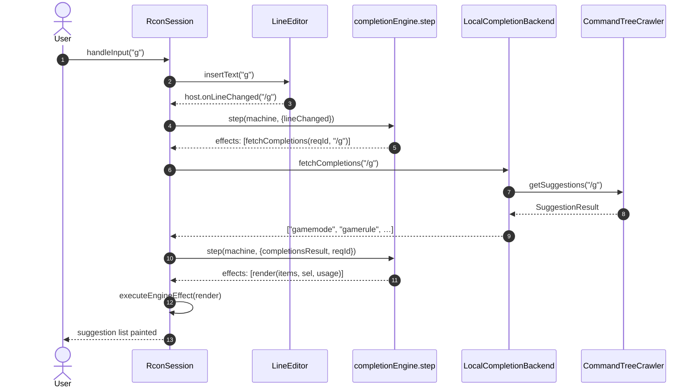
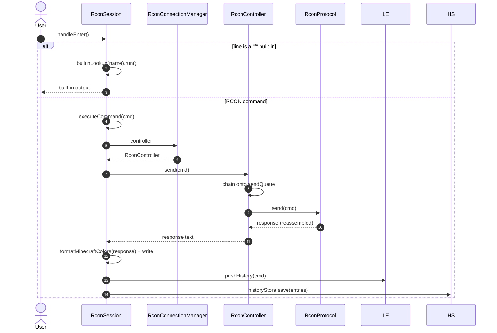
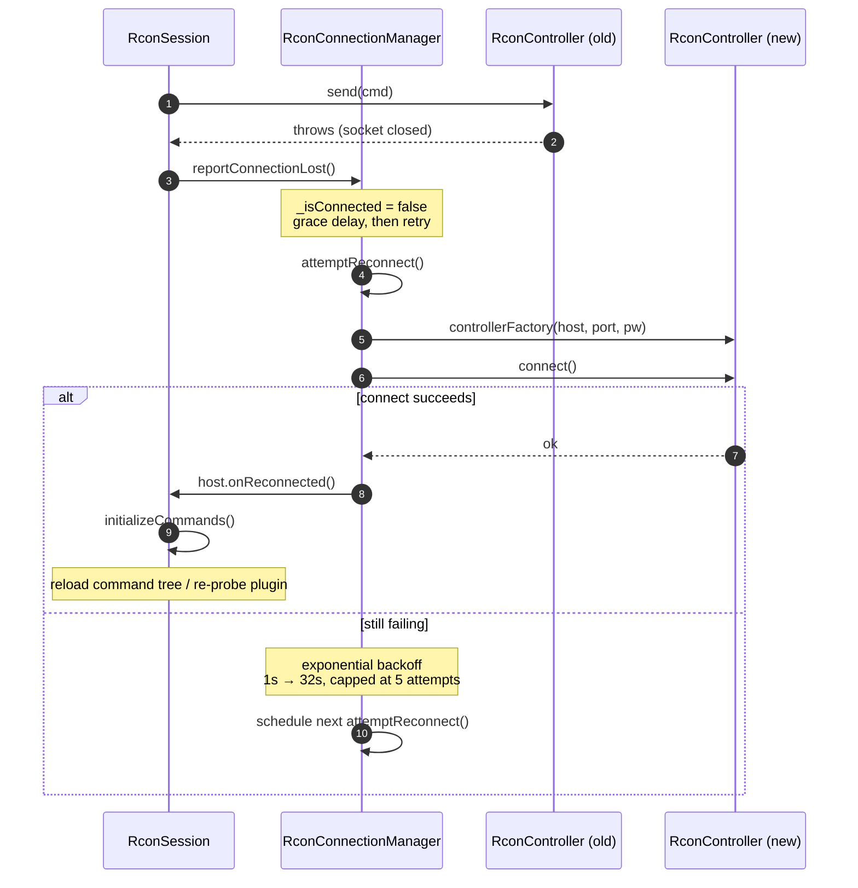
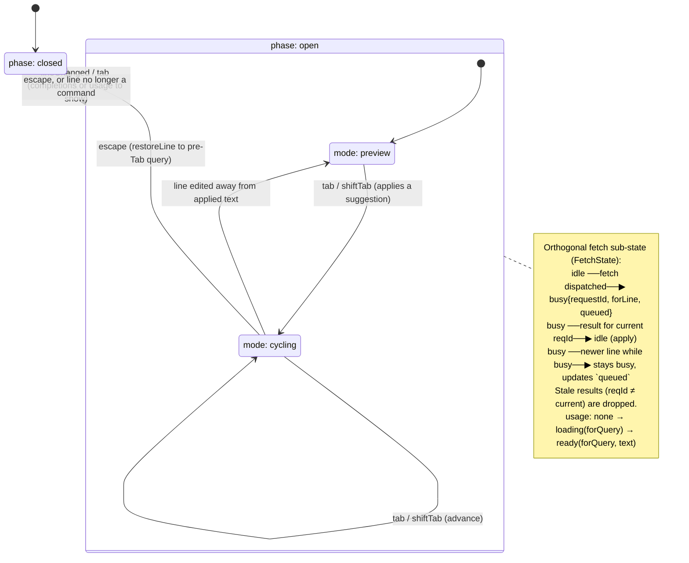

# UML reference

A detailed, diagram-first companion to [ARCHITECTURE.md](ARCHITECTURE.md).
Where `ARCHITECTURE.md` explains *why* each module is shaped the way it is in
prose, this document draws the *structure* — classes, interfaces, the
discriminated-union data models, the relationships between them — plus a few
behavioural diagrams (sequences and a state machine) for the flows that are
hard to see from static structure alone.

All diagrams are [Mermaid](https://mermaid.js.org/); GitHub renders them
inline. Member lists are **representative of the public surface**, not
exhaustive — private helpers are omitted unless they're load-bearing for
understanding a relationship. Names track the code as of this writing; if they
drift, the source is the source of truth.

## How to read the relationship arrows

| Arrow | Mermaid | Meaning here |
|---|---|---|
| Solid triangle | `<|--` | Class inheritance (`extends`) |
| Dashed triangle | `<|..` | Interface realization (`implements`) |
| Filled diamond | `*--` | Composition — owner constructs/owns the part's lifetime |
| Open diamond | `o--` | Aggregation — holds a reference it didn't necessarily create |
| Solid arrow | `-->` | Association — holds/uses a reference |
| Dashed arrow | `..>` | Dependency — calls into / constructs, but doesn't retain |

The codebase layers bottom-up: **RCON connection → command knowledge →
completion engine → terminal UI → orchestration → host adapters**, with two
shared utilities (`ansi.ts`, `logger.ts`) used throughout. Each layer gets its
own class diagram below; the orchestration diagram ties them together.

---

## 1. RCON connection layer

The wire protocol and its lifecycle. `RconProtocol` speaks bytes; `RconController`
serializes commands onto it; `RconConnectionManager` owns connect/reconnect.
Both lower classes take a *factory* for the layer beneath them (`createSocket`,
`createProtocol`, `controllerFactory`) so tests can substitute fakes without a
real socket.

> **`RconController.send` serialization.** Every `send()` chains onto
> `sendQueue` so at most one RCON exchange is in flight at a time — concurrent
> exchanges over one socket make some servers drop the connection. See
> [TECHNICAL.md](TECHNICAL.md) for the deferred-fence reassembly that
> `RconProtocol.send`/`handlePacket` implement.

---

## 2. Command-knowledge layer

"What can the user type, and what does it mean." `CommandTreeCrawler`
orchestrates: it loads a cached tree or crawls `/help`, using the two pure
parsing modules to interpret responses, and persists via `CommandTreeCache`.
The tree itself is the `Parameter` discriminated union (`commandTree.ts`), read
back by the pure `getSuggestions` function.

### The `Parameter` model (`commandTree.ts`)

A recursive discriminated union tagged by `ParameterType`. A root command is a
`SubcommandParameter` aliased as `CommandNode`. Everything that builds a tree
produces `Parameter`s; everything that reads one (`commandTreeSuggestions`,
`displayArgumentHint`, `displayCommandTree`) consumes them.

> The crawl strategy itself — `/help` vs. `minecraft:help`, Brigadier vs.
> Bukkit grammars, source merging — is documented in
> [NO_PLUGIN_HELP_CRAWL.md](NO_PLUGIN_HELP_CRAWL.md).

---

## 3. Tab-completion engine

A pure reducer. `step(machine, event)` returns the next `Machine` plus a list
of declarative `Effect`s the shell executes; it never touches the network, the
clock, or the terminal. The `CompletionBackend` seam is where "where do
completions come from" is answered — once, by picking an implementation.

The engine's own behaviour — phases, modes, and how async races resolve — is
drawn as a state machine in [§8](#8-completion-engine-state-machine).

---

## 4. Terminal UI layer

Rendering and editing, independent of RCON. Each class talks to its host via a
narrow `*Host` interface (all supplied by `RconSession`). `SuggestionDisplay`
delegates argument-hint formatting to the pure `formatArgumentHint`.

---

## 5. Orchestration & host adapters

`RconSession` is the host-agnostic conductor: it owns one of everything above,
constructs the `*Host` implementations the components need, holds the engine's
`Machine` value, and is the only place that drives `step()`. It runs behind the
narrow `RconSessionHost` interface — implemented by `cli.ts`, which is also the
process the VS Code `extension.ts` spawns as its integrated terminal.

---

## 6. Shared utilities

- **`ansi.ts`** — named SGR escape codes and `style`/colour helpers, plus
  `formatMinecraftColors` / `stripColors` (the `§`-code ↔ ANSI translation).
  Pure; imported almost everywhere in the UI and orchestration layers.
- **`logger.ts`** — just `errorMessage(err): string`. Logging itself is
  [consola](https://github.com/unjs/consola)'s `ConsolaInstance`, constructed in
  `cli.ts`/`extension.ts` and passed by reference to every class that logs.
- **`commandLine.ts`** — `splitCommandLine(input): CommandLineParts`
  (`{ parts, hasTrailingSpace }`), the shared tokenizer used by the engine and
  the suggestion logic.
- **`completionQueries.ts`** — pure `build*Query` / `parse*Response` helpers
  bridging engine input lines and the `tabcomplete`/`cmdusage` wire strings,
  used by `RconCompletionBackend`.

---

## 7. Sequence diagrams

### 7.1 Typing a character (local mode)

A keystroke flows down to the line editor, back up as a `lineChanged` event
into the engine, out as a `fetchCompletions` effect, into the local tree, and
finally back into the engine as a result that produces a `render` effect.

> In **plugin mode** the only change is the backend: `RconCompletionBackend`
> replaces steps 7–9, issuing `tabcomplete /g` over RCON instead of querying
> the local tree. `RconSession` is mode-blind — it holds whichever backend
> `pluginMode` selected.

### 7.2 Executing a command (Enter)

Built-ins are handled in-process via a lookup table; anything else is sent to
the server, then recorded in history.

### 7.3 Connection drop and auto-reconnect

A failed in-flight `send` tells the manager the connection is gone; it backs
off, rebuilds the controller, and on success asks the session to reload its
command tree.

---

## 8. Completion-engine state machine

The shape behind `completionEngine.ts`. The visible **phase** is `closed` or
`open`; while open, a **mode** distinguishes live previewing from Tab-driven
cycling. Orthogonally, a **fetch** sub-state tracks the single in-flight request
and the newest line queued behind it — this is where every async race (a reply
landing after the user typed more, overlapping requests) is resolved as an
ordinary transition rather than ad-hoc guard code.

> The argument-hint behaviour layered on top of `usage` (when it appears,
> sticks, and is re-fetched) is specified story-by-story in
> [ARGUMENT_HINT_UX_STORIES.md](ARGUMENT_HINT_UX_STORIES.md).
